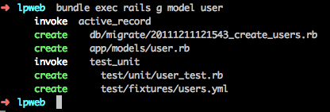
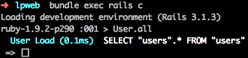
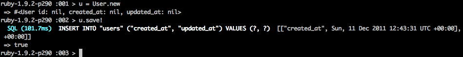
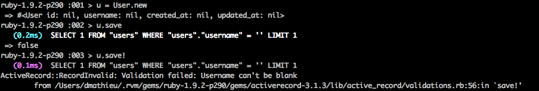
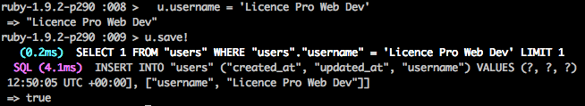

!SLIDE
# Création d'un modèle

    bundle exec rails g model user

!SLIDE small
# db/migrate/xxx\_create\_users.rb

    @@@ ruby
    class CreateUsers < ActiveRecord::Migration
      def change
        create_table :users do |t|
          t.string   :username

          t.timestamps
        end
      end
    end

    bundle exec rake db:migrate

!SLIDE small
# app/models/user.rb

    @@@ ruby
    class User < ActiveRecord::Base
    end

!SLIDE small

    bundle exec rails console
    User.all

!SLIDE small

    @@@ ruby
    u = User.new
    user.save!

!SLIDE small

    @@@ ruby
    class User < ActiveRecord::Base

      validates :username,
        :presence => true,
        :uniqueness => true
    end

!SLIDE small

