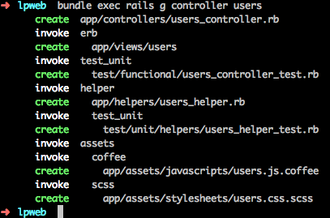
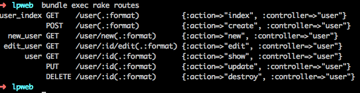

!SLIDE small
# Création d'un contrôleur

    bundle exec rails g controller users

!SLIDE small

# app/controllers/users\_controller.rb

    @@@ ruby
    class UsersController < ApplicationController
      respond_to :html, :json

      def index
        @users = User.all
        respond_with @users
      end

      def show
        @user = User.find params[:id]
        respond_with @users
      end
    end

!SLIDE small
# app/views/users/index.html.erb

    @@@ erb
    <ul>
      <% @users.each do |user| %>
        <li><%= link_to user.username, user %></li>
      <% end %>
    </ul>

!SLIDE small
# config/routes.rb

    @@@ ruby
    Lpweb::Application.routes.draw do
      resources :users

    end

!SLIDE small

    bundle exec rake routes

!SLIDE small
# app/views/users/show.html.erb

    @@@ erb
    <h1><%= @user.username %></h1>

!SLIDE small

    bundle exec rails server

!SLIDE small
# app/controllers/users\_controller.rb

    @@@ ruby
    class UsersController < ApplicationController
      def new
        @user = User.new
        respond_with @user
      end

      def create
        @user = User.new params[:user]
        @user.save
        respond_with @user
      end
    end

!SLIDE small

# app/views/users/new.html.erb

    @@@ erb
    <%= form_for @user do |f| %>
      <%= f.text_field :username %>
      <%= f.submit %>
    <% end %>

!SLIDE small

# app/controllers/users\_controller.rb

    @@@ ruby
    class UsersController < ApplicationController

      def edit
        @user = User.find params[:id]
        respond_with @user
      end

      def update
        @user = User.find params[:id]
        @user.update_attributes params[:user]
        respond_with @user
      end
    end

!SLIDE small
# app/views/users/edit.html.erb

    @@@ erb
    <%= form_for @user do |f| %>
      <%= f.text_field :username %>
      <%= f.submit %>
    <% end %>

!SLIDE small

# app/controllers/users\_controller.rb

    @@@ ruby
    class UsersController < ApplicationController

      def destroy
        @user = User.find params[:id]
        @user.destroy
        respond_with @user
      end
    end

!SLIDE

# ENJOY
